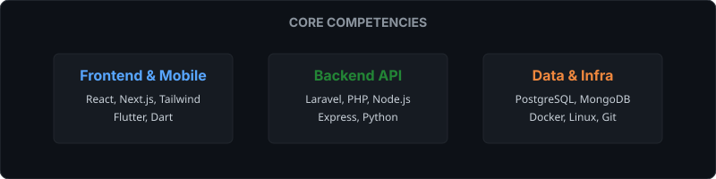

  

##  About Me

I am a **Full Stack Developer, Mobile, and Backend Engineer** based in Malawi, currently pursuing a degree in Business Information Technology. I focus on building resilient, scalable systems that solve complex, real-world problems. 

Whether it's orchestrating backend logic with Laravel and Node.js or crafting fluid mobile experiences with Flutter, I aim for clean architecture and performant code.

- 🎓 **Education:** Business Information Technology Student
- 💡 **Interests:** System Architecture, Mobile App Engineering, Data Analytics
- 🚀 **Current Focus:** Advanced Backend Optimization & Scalable Systems

---

## 🛠 Skills & Tech Stack

  

---

## 💻 Featured Projects

### 1. Bus Ticket Booking System 
*A unified platform for web, mobile, and feature phones (USSD).*
- **Stack:** Laravel, PostgreSQL, React, Flutter, USSD integration
- **Features:** Real-time seat allocation, payment gateways, QR check-in, passenger manifest generation.

### 2. Records Management System
*Records management system for MUST CSIT Society. Worked as a Backend Engineer.*
- **Stack:** Laravel, PostgreSQL, LogoTo Auth
- **Features:** Records management, Membership management, Event management, 

### 3. Portfolio Website
*High-end interactive web experience.*
- **Stack:** React, Tailwind CSS, Framer Motion
- **Features:** Scroll-driven animations, parallax effects, dynamic responsive design.

---

## 🏗 Architecture & Methodology

I prioritize a robust SDLC involving:
- **Clean Architecture:** Separation of concerns, repository patterns, and scalable micro-services when necessary.
- **Data Integrity:** Strict relational models in PostgreSQL/MySQL, mixed with NoSQL (MongoDB) for unstructured telemetry.
- **CI/CD:** Automated testing, containerization with Docker, and safe deployments.

---

## 📊 GitHub Analytics

  
  

---

## 💬 Contact

Let's discuss architecture, performance optimization, or your next big idea.
- 🔗 **LinkedIn:** [Benjamin Mwambakulu](https://www.linkedin.com/in/benjamin-mwambakulu-0a9a2237a)
- 🐙 **GitHub:** [@BenjaminMwambakulu](https://github.com/BenjaminMwambakulu)
- 📸 **Instagram:** [@mwambakulubenjamin](https://www.instagram.com/mwambakulubenjamin/)
- 📘 **Facebook:** [Benjamin Mwambakulu](https://web.facebook.com/profile.php?id=100076844325461)

> *"Simplicity is a prerequisite for reliability." — Edsger W. Dijkstra*
